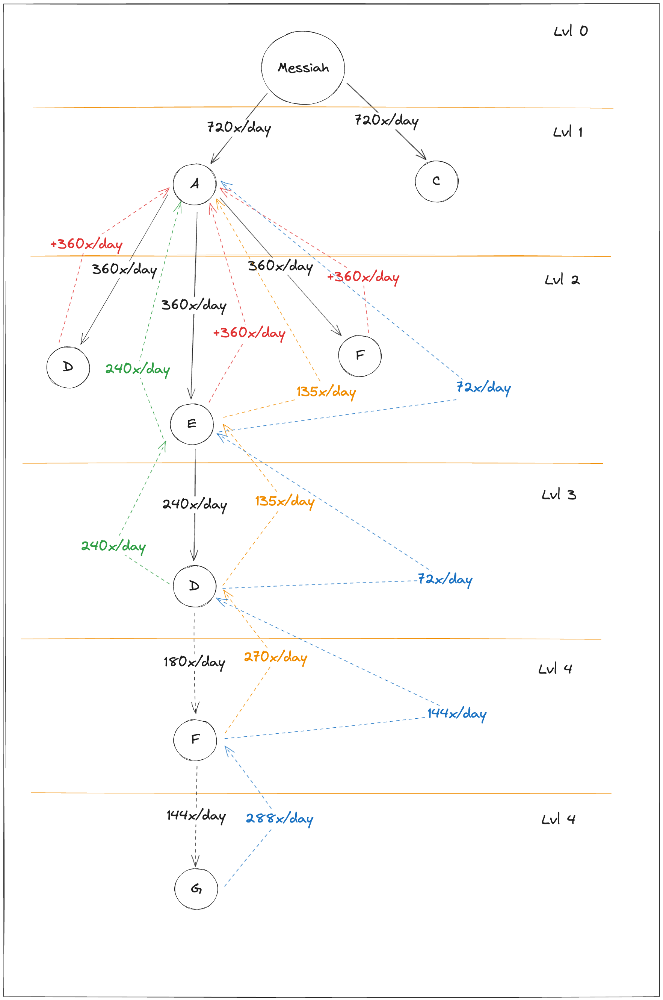

# Superfluid Club Smart Contract

_This README will help users and developers understand the functionalities, data structures, and logic flow of the contract._

## Overview
The Superfluid Club contract is designed to facilitate the operations of a club using the Superfluid finance protocol.
The club is structed as a sponsorship chain (tree), where a person can become a "protege" under another person's sponsorship.

## Features:

- The club's operations revolve around "sponsorships" and "proteges".
- A person can become a "protege" under another person's sponsorship, creating a sponsorship relationship.
- Sponsorship can go up to a defined `MAX_SPONSORSHIP_LEVEL`.
- Each new protege added, the club can generate more 720 tokens per day, distributed among the protege and sponsors in the sponsorship chain.

## Key Components:
Each participant (Protege) in the system is described by a struct which contains:

- `sponsor`: Address of the entity that sponsored them.
- `level`: Hierarchical level in the sponsorship tree.
- `totalProtegeCount`: Total number of Proteges under them (including indirect).
- `directTotalProtegeCount`: Total number of Proteges directly under them.
- `desiredFlowRate`: Desired rate of token stream from its sponsor.

## Sponsorship Logic:
Sponsorship: New address becomes a Protege and is linked to a sponsor. A certain amount of token is streamed to new Protege and to all sponsors in that specific branch tree.

## Formulas & Calculations:

- **Protege flowRate**: `protegeDesiredFlowRate = MAX_SPONSORSHIP_PATH_OUTFLOW / level / 86400`

- **Sponsor updated flowRate**: `distributableAmount = MAX_SPONSORSHIP_PATH_OUTFLOW - protegeDesiredFlowRate where each sponsor gets 50% and last level takes the rest`
  - Sponsors near the new Protege will get more tokens than those far away.

```solidity 
// if last sponsor in the chain take remaining amount, else take 50% of available amount
int96 sponsorDesiredFlowRate =
  sponsorChainInfo.level == 1 ? distributableAmount : (distributableAmount * 50000) / 100000;

sponsorChainInfo.desiredFlowRate += sponsorDesiredFlowRate; // increase sponsor flowRate

distributableAmount -= sponsorDesiredFlowRate;
```


## Examples:

Basic case of adding a new Protege to the system:

[](./img/graph1.png)